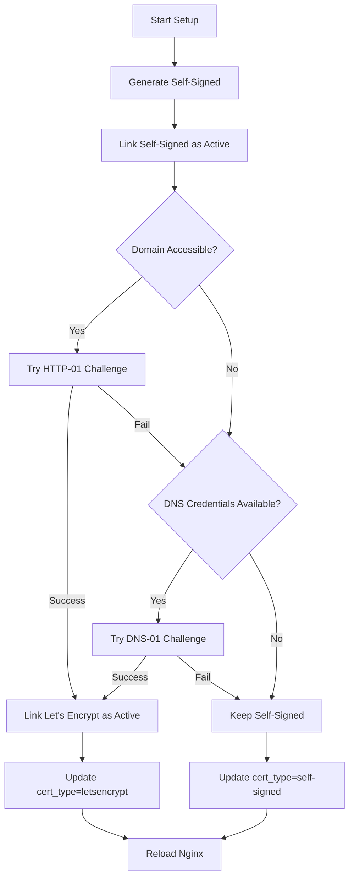
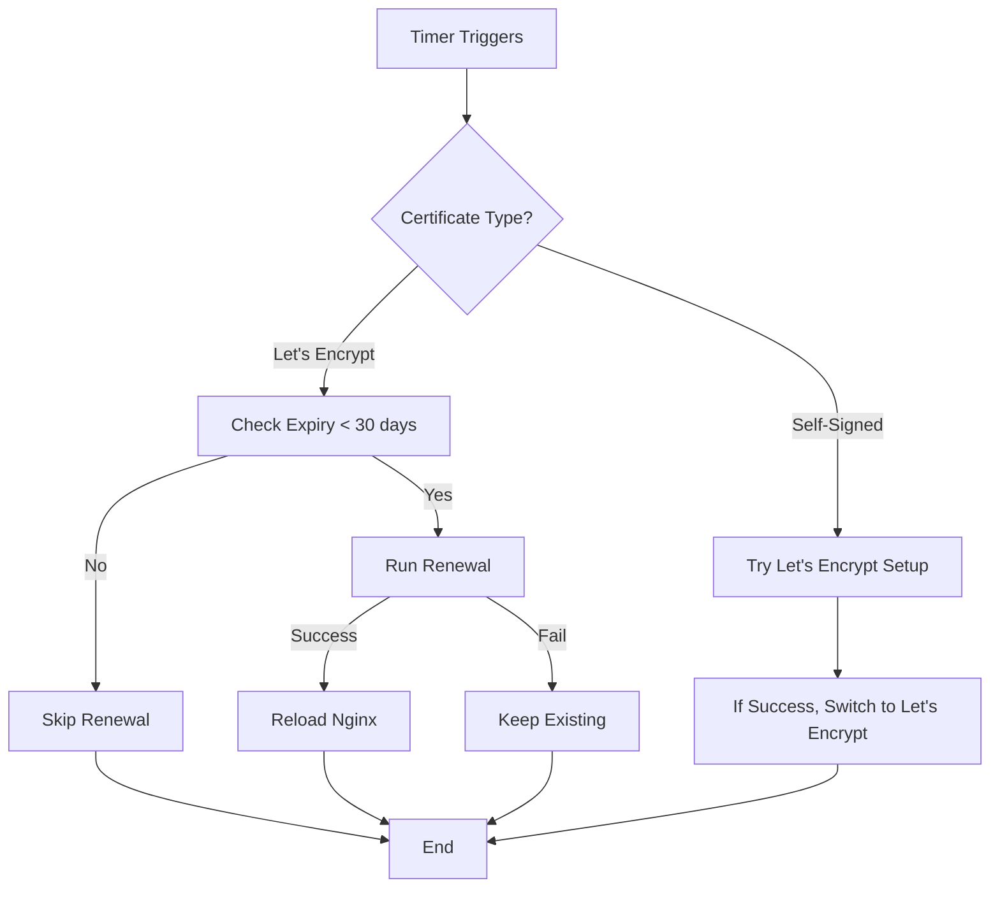

# 🔐 SSL Certificate Management Setup Guide

## Overview

This guide covers the implementation of automated SSL certificate management for the nginx reverse proxy with self-signed fallback and Let's Encrypt automation via systemd services.

## 🏗️ Architecture

```
┌─────────────────────┐    ┌──────────────────────┐    ┌─────────────────────┐
│   Self-Signed       │    │   Let's Encrypt      │    │   Systemd Service   │
│   (Fallback)        │───▶│   (Primary)          │───▶│   (Auto-Renewal)    │
└─────────────────────┘    └──────────────────────┘    └─────────────────────┘
           │                           │                           │
           ▼                           ▼                           ▼
┌─────────────────────────────────────────────────────────────────────────────┐
│                          Nginx SSL Configuration                            │
│  • Dynamic certificate switching                                           │
│  • HTTP to HTTPS redirect                                                  │
│  • ACME challenge support                                                  │
│  • Security headers                                                        │
└─────────────────────────────────────────────────────────────────────────────┘
```

## 📁 File Structure

```
nginx/
├── scripts/
│   ├── ssl-manager.sh              # Main SSL management script
│   └── install-ssl-systemd.sh      # Systemd service installer
├── config/
│   ├── nginx/conf.d/
│   │   ├── ssl.conf                # SSL configuration
│   │   └── default.conf            # Server configuration
│   └── systemd/
│       ├── nginx-ssl-manager.service
│       └── nginx-ssl-manager.timer
├── ssl/
│   ├── self-signed/                # Self-signed certificates
│   ├── letsencrypt/                # Let's Encrypt certificates
│   ├── server.crt                  # Active certificate (symlink)
│   ├── server.key                  # Active private key (symlink)
│   └── cert_type                   # Certificate type indicator
└── docker-compose.yml
```

## 🚀 Installation

### Step 1: Basic Setup

```bash
# Navigate to nginx project
cd /path/to/nginx

# Make scripts executable
chmod +x scripts/*.sh

# Run initial SSL setup
./scripts/ssl-manager.sh setup
```

### Step 2: Install Systemd Services (Production)

```bash
# Install systemd services for automatic renewal
sudo ./scripts/install-ssl-systemd.sh install

# Check service status
nginx-ssl-service status

# View logs
nginx-ssl-service logs
```

### Step 3: Configure Environment

```bash
# Edit environment configuration
sudo nano /opt/nginx/.env

# Required settings:
DOMAIN_NAME=your-domain.com
LETSENCRYPT_EMAIL=admin@your-domain.com

# Optional (for DNS challenge):
CLOUDFLARE_EMAIL=your-email@cloudflare.com
CLOUDFLARE_API_TOKEN=your-api-token
```

## 🎯 SSL Manager Commands

### Direct SSL Management

```bash
# Initial setup with automatic fallback
./scripts/ssl-manager.sh setup

# Generate only self-signed certificate
./scripts/ssl-manager.sh self-signed

# Generate only Let's Encrypt certificate
./scripts/ssl-manager.sh letsencrypt

# Renew existing certificates
./scripts/ssl-manager.sh renew

# Show certificate status
./scripts/ssl-manager.sh status

# Help
./scripts/ssl-manager.sh help
```

### Systemd Service Management

```bash
# Show service status
nginx-ssl-service status

# Follow renewal logs
nginx-ssl-service logs

# Run renewal immediately
nginx-ssl-service run-now

# Enable automatic renewal
nginx-ssl-service enable

# Disable automatic renewal
nginx-ssl-service disable

# Restart timer service
nginx-ssl-service restart
```

## 🔄 Certificate Management Flow

### 1. Initial Setup



### 2. Automatic Renewal



## 🔧 Configuration Details

### SSL Configuration (`config/nginx/conf.d/ssl.conf`)

- **Protocols**: TLS 1.2 and 1.3 only
- **Ciphers**: Modern, secure cipher suites
- **HSTS**: Enabled with preload
- **OCSP Stapling**: Enabled for Let's Encrypt
- **Security Headers**: Comprehensive security headers

### Server Configuration (`config/nginx/conf.d/default.conf`)

- **HTTP to HTTPS Redirect**: Automatic redirection
- **ACME Challenge**: Support for Let's Encrypt validation
- **Proxy Configuration**: Ready for backend services
- **Security**: Hidden files protection, server tokens off

### Systemd Configuration

- **Service**: One-shot service for certificate operations
- **Timer**: Runs twice daily (2 AM and 2 PM) with randomization
- **Logging**: Comprehensive logging to journald
- **Security**: Restricted permissions and capabilities

## 🛡️ Security Features

### Certificate Security

1. **4096-bit RSA Keys**: Strong encryption for self-signed certificates
2. **Modern TLS**: Only TLS 1.2 and 1.3 supported
3. **Perfect Forward Secrecy**: DH parameters for key exchange
4. **OCSP Stapling**: Real-time certificate validation

### HTTP Security Headers

```nginx
# HSTS with preload
Strict-Transport-Security: max-age=63072000; includeSubDomains; preload

# XSS Protection
X-Content-Type-Options: nosniff
X-Frame-Options: DENY
X-XSS-Protection: 1; mode=block

# Content Security Policy
Content-Security-Policy: default-src 'self'; ...

# Referrer Policy
Referrer-Policy: strict-origin-when-cross-origin
```

### Systemd Security

- **No New Privileges**: Prevents privilege escalation
- **Protected System**: Read-only system directories
- **Private Temp**: Isolated temporary directories
- **Restricted Paths**: Limited filesystem access

## 📊 Monitoring and Logging

### Certificate Status

```bash
# Check certificate details
nginx-ssl status

# View renewal logs
nginx-ssl-service logs

# Check systemd service status
systemctl status nginx-ssl-manager.timer
```

### Certificate Expiry Monitoring

```bash
# Manual expiry check
openssl x509 -enddate -noout -in /opt/nginx/ssl/server.crt

# Automated monitoring (built into renewal service)
# Checks every 12 hours, renews when < 30 days remaining
```

## 🔄 Integration with Deployment

### GitHub Actions Integration

Add to your nginx deployment workflow:

```yaml
- name: 🔐 Setup SSL Certificates
  run: |
    # Install SSL management
    sudo ./scripts/install-ssl-systemd.sh install
    
    # Configure environment
    echo "DOMAIN_NAME=${{ inputs.service_name }}.7gram.xyz" | sudo tee -a /opt/nginx/.env
    echo "LETSENCRYPT_EMAIL=admin@7gram.xyz" | sudo tee -a /opt/nginx/.env
    
    # Add Cloudflare credentials if available
    if [ -n "${{ secrets.CLOUDFLARE_EMAIL }}" ]; then
      echo "CLOUDFLARE_EMAIL=${{ secrets.CLOUDFLARE_EMAIL }}" | sudo tee -a /opt/nginx/.env
      echo "CLOUDFLARE_API_TOKEN=${{ secrets.CLOUDFLARE_API_TOKEN }}" | sudo tee -a /opt/nginx/.env
    fi
    
    # Run initial setup
    sudo nginx-ssl setup

- name: 🔄 Start Nginx with SSL
  run: |
    docker-compose up -d nginx
    
    # Wait for nginx to start
    sleep 10
    
    # Verify SSL is working
    curl -k https://localhost/health
```

## 🎯 Best Practices

### 1. Environment Configuration

```bash
# Always set these
DOMAIN_NAME=your-domain.com
LETSENCRYPT_EMAIL=admin@your-domain.com

# Optional but recommended for reliability
CLOUDFLARE_EMAIL=your-email@cloudflare.com
CLOUDFLARE_API_TOKEN=your-api-token
```

### 2. Certificate Management

- **Fallback Strategy**: Always have self-signed as backup
- **Monitoring**: Regular certificate expiry monitoring
- **Logging**: Keep detailed logs for troubleshooting
- **Testing**: Test certificate renewal process regularly

### 3. Security

- **Key Permissions**: Ensure private keys are properly protected (600)
- **Regular Updates**: Keep certbot and nginx images updated
- **Monitoring**: Monitor certificate expiry and renewal status

### 4. Deployment

- **Staged Rollout**: Test SSL setup in development first
- **Health Checks**: Always verify SSL endpoint health
- **Rollback Plan**: Keep previous certificates for quick rollback

## 🚨 Troubleshooting

### Common Issues

1. **Domain Not Accessible**
   ```bash
   # Check DNS resolution
   dig +short your-domain.com
   
   # Check port accessibility
   telnet your-domain.com 80
   ```

2. **Let's Encrypt Rate Limits**
   ```bash
   # Use staging environment for testing
   # Add --staging to certbot commands
   ```

3. **Certificate Permissions**
   ```bash
   # Fix certificate permissions
   sudo chown -R root:root /opt/nginx/ssl
   sudo chmod 600 /opt/nginx/ssl/*.key
   sudo chmod 644 /opt/nginx/ssl/*.crt
   ```

4. **Nginx Configuration Errors**
   ```bash
   # Test nginx configuration
   docker-compose exec nginx nginx -t
   
   # Check SSL configuration
   openssl s_client -connect your-domain.com:443
   ```

### Log Locations

- **SSL Manager**: `/var/log/nginx-ssl/manager.log`
- **Systemd Service**: `journalctl -u nginx-ssl-manager.service`
- **Nginx**: Docker container logs via `docker-compose logs nginx`

## 🎉 Conclusion

This SSL management system provides:

✅ **Automatic Fallback**: Self-signed certificates when Let's Encrypt fails  
✅ **Zero Downtime**: Seamless certificate switching  
✅ **Production Ready**: Systemd integration with proper security  
✅ **Multiple Challenges**: HTTP-01 and DNS-01 support  
✅ **Comprehensive Logging**: Full audit trail  
✅ **Easy Management**: Simple command-line interface  

The system is designed to "just work" while providing full control when needed.
